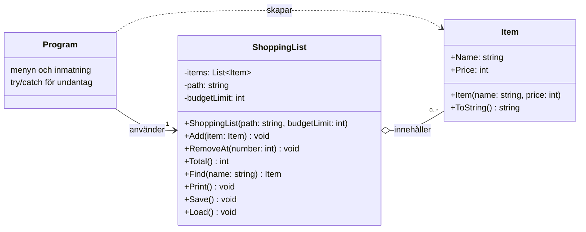

# Felrapport

### 1. *Load* kraschade pga. blankrad i slutet på txt-filen.
*Vad hände:*  
Programmet kraschade direkt i start pga blankrad i slutet på txt-filen. `parts[1]` på tom rad ger `IndexOutOfRangeException`. Samma orsak gjorde också att enbart sista varan visades med namn och pris, de andra visade enbart priset.

*Varför:*  
Varje rad slutar med `\r\n` och `Split('\n')` klipper vid det sista `\n` vilket skapar ett nytt tomt element där `parts[1]` saknas och det kraschar.
Det här lämnade också kvar `\r` i slutet av varje namn och gjorde att varornas namn skrevs över av priset och därför inte syntes i listan (om det redan fanns en lista när programmet startades).  

*Lösning:*  
Jag ändrade till `ReadAllLines` istället för `ReadAllText`. `ReadAllLines` hanterar radbrytningarna åt mig. 
Jag lade även till två if-satser - en som kollar så att det endast finns två delar på raden (namn och pris) och om det inte är så ska den raden hoppas över och en som använder TryParse för att kolla om priset är giltigt och om inte hoppa över raden, den sista hör ihop med fel 3.

### 2. *RemoveAt* kraschade om man skriver andra tal än de som finns i listan.  
*Vad hände:*  
Om jag t.ex. försökte ta bort nummer 8 i en lista med 3 varor kraschade programmet med `ArgumentOutOfRangeException`. Detsamma om jag försökte ta bort nummer 0 eftersom `number - 1` då blir -1.  

*Varför:*
Raden `items.RemoveAt(number - 1)` försökte ta bort en vara som inte fanns i listan. Listan kastar felet när indexet inte finns.   

*Lösning:*  
Jag lade till en `if` som kollar att numret man skriver är innanför spannet av listans antal varor, en `throw` i `RemoveAt` och en `try/catch` i `Program.cs`, så att användaren får ett tydligt felmeddelande.
	
### 3. *int.Parse* i Program.cs.
*Vad hände:*  
Programmet kraschade med `FormatException` om jag skrev bokstäver eller bara Enter. Detta skedde i menyvalet, vid pris och ta bort vara. 

*Varför:*
`int.Parse` gör om en sträng till ett heltal men om strängen inte är ett tal så kastar `FormatException` och programmet kraschar. Programmet utgår från att användaren alltid skriver ett tal.    

*Lösning:*  
Genom att göra om det till `int.TryParse` så kollar man istället om strängen är ett tal och får tillbaka `true` eller `false`. Om strängen inte är ett tal så returneras `false` och inget kraschar. På så sätt fångar jag upp om användaren skriver något annat än nummer i de här valen. Jag lade in det i en `if` och lade till ett meddelande om returvärdet var falskt samt en `continue;` så att programmet fortsätter och inte avbryts. I menyvalet kontrollerar jag också att talet är 1 till 5.

### 4. *Saknad fil*  
*Vad hände:*  
Om jag bytte namn på filen så kunde programmet inte hitta den och det kraschade med `FileNotFoundException`.

*Varför:*  
`Load` är det första som anropas i programmet och förutsätter att filen finns. Om inte filen finns för att den är raderad eller har bytt namn så kraschar det i `File.ReadAllLines(path)`.

*Lösning:*  
Jag lade till en `try/catch`. `try` ligger enbart runt raden som läser filen och i `catch` en `FileNotFoundException` med förklaring att listan inte skapats än och en `return;` som avslutar `Load` så att listan förblir tom och programmet fortsätter. Det är normalt att filen inte finns första gången programmet körs utan den skapas med `Save` när man sparar första gången.

### 5. *Total* ger fel resultat:  
*Vad hände:*  
Totalsumman stämde inte då första varan inte räknades med. Med varorna 15, 32 och 89 visade programmet 121 i stället för 136, men kraschade inte.

*Varför:*  
Startvärdet i `for`-loopen var satt till 1 vilket innebar att man inte räknade med första varan eftersom index i en lista börjar på 0. Loopen hoppade alltså över `items[0]`. 

*Lösning:*  
Jag ändrade startindex i `for`-loopen till 0.

### 6. Gömt fel i *Save*:
*Vad hände:*  
Jag provade att skrivskydda filen, programmet kraschade inte utan skrev att listan var sparad trots att den inte var det.

*Varför:*  
Eftersom `catch` var tom så fångades undantaget men inget gjordes och programmet fortsatte till nästa rad som var `Console.WriteLine("Listan är sparad.");` och därför kördes oavsett om filen lyckats sparas eller inte. 

*Lösning:*  
Jag flyttade upp "Listan är sparad" till `try` och lade in `UnauthorizedAccessException` och `IOException` i `catch`. `UnauthorizedAccessException` fångar skrivskydd eller saknad behörighet, och `IOException` fångar till exempel att filen är låst av ett annat program eller att disken är full. I varje `catch` finns nu också ett meddelande som säger att listan inte sparats. 

# Designval
När budgettaket spricker upptäcks det i `Add` som kastar `InvalidOperationException`. Jag valde en `throw` framför en `bool: false` för då får `Program.cs` veta att något gick fel, ett undantag kan inte ignoreras av misstag. Med en `bool` måste `Program.cs` komma ihåg att kolla svaret varje gång, annars lätt glöms det bort. Regeln ligger i `ShoppingList` men det är `Program.cs` som pratar med användaren. `Program.cs` tar emot svaret och skriver ett felmeddelande till användaren genom `catch` och programmet fortsätter.

# Klassdiagram

